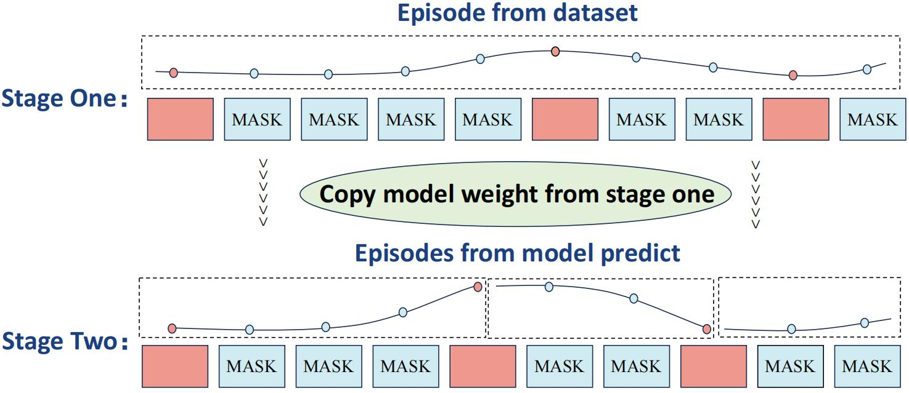
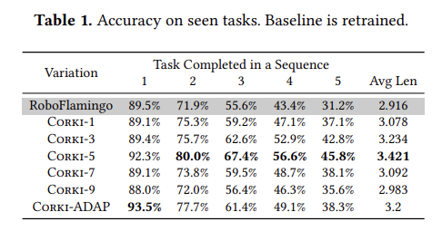

<h1 align="center">Corki: Enabling Real-time Embodied AI Robots via Algorithm-Architecture Co-Design</h1>


[](https://arxiv.org/abs/2407.04292)

This is also the official code repo for the paper [Corki: Enabling Real-time Embodied AI Robots via Algorithm-Architecture Co-Design](https://arxiv.org/pdf/2407.04292)

If you have any questions about the paper and code, please contact us.

All our experiments are conducted on a 8 GPUS server with 8 Nvidia A100 GPUs (80G).

## Download the Calvin dataset and models:

Our repository is built based on the work RoboFlamingo . Please follow the [RoboFlamingo](https://github.com/RoboFlamingo/RoboFlamingo)  to download the corresponding [OpenFlamingo](https://github.com/mlfoundations/open_flamingo) model  checkpoints, conda environment, and the [Calvin](https://github.com/mees/calvin) dataset.

## Training the model (using DDP):

#### Corki-N

```python
bash tools/train.sh robot_flamingo/configs/robot_flamingo_episode_sum_multi_9steps_take_5steps.args
```

You can train **Corki-n** by modifying the `take_steps` value to `n` in the file `robot_flamingo/configs/robot_flamingo_episode_sum_multi_9steps_take_5steps.args`

#### Corki-ADAP

Adaptive training is divided into two stages:



- In the first stage, we use the episodes in the dataset to get proper adaptive steps through our waypoints extraction algorithm, in order to make the trajectories predicted by the model easier to converge, so we train 5 epochs first.

  ```python
  bash tools/train.sh robot_flamingo/configs/robot_flamingo_episode_adaptive.args
  ```

- In the second stage, we will extract waypoints from the trajectory predicted by the model during the inference time to determine how many steps to accelerate. Therefore, in order to ensure that our training is consistent with our evaluation process, we use the final checkpoint from the first stage to continue training. In this 5 epochs training, we will use the predicted trajectory to extract waypoints.

  ```
  bash tools/train.sh robot_flamingo/configs/robot_flamingo_episode_sum_adaptive_model_output.args
  ```

## Evaluating the model on the CALVIN benchmark



```
python eval_ckpts.py
```

- Make sure you use the same configuration as your training before testing, If you change the configuration in training, you need to change `robot_flamingo/pt_eval_ckpts.bash` during testing.

  ```
  # Example for Corki-5,make sure they are same with the .args files you used in training
  if [ ${use_gripper} -eq 1 ] && [ ${use_state} -eq 0 ]
  then
  torchrun --nnodes=1 --nproc_per_node=${node_num}  --master_port=6099 robot_flamingo/eval/eval_calvin.py \
      --precision fp32 \
      --use_gripper \
      --window_size ${window_size} \
      --fusion_mode ${fusion_mode} \
      --run_name RobotFlamingoDBG \
      --calvin_dataset ${calvin_dataset_path} \
      --lm_path ${lm_path} \
      --tokenizer_path ${tokenizer_path} \
      --cross_attn_every_n_layers 4 \
      --evaluate_from_checkpoint ${evaluate_from_checkpoint} \
      --calvin_conf_path ${calvin_conf_path} \
      --use_episode \
      --multi_step_action 9
      --action_num 5 \ # the same with the take_steps in training
      --mask_ratio 0.2 \
      --episode_loss point_sum \
      --workers 1 |& tee -a ${log_file}
  ```

## Contact

If you have any confusion about this repo, feel free to send a email to [huangyiyang24@mails.ucas.ac.cn](huangyiyang24@mails.ucas.ac.cn) or raise a issue, we will reply and improve as soon as possible.

## Acknowledgment

#### CALVIN

Original:  [https://github.com/mees/calvin](https://github.com/mees/calvin)
License: [MIT](https://github.com/mees/calvin/blob/main/LICENSE)

#### OpenAI CLIP

Original: [https://github.com/openai/CLIP](https://github.com/openai/CLIP)
License: [MIT](https://github.com/openai/CLIP/blob/main/LICENSE)

#### OpenFlamingo

Original: [https://github.com/mlfoundations/open_flamingo](https://github.com/mlfoundations/open_flamingo)
License: [MIT](https://github.com/mlfoundations/open_flamingo/blob/main/LICENSE)

#### RoboFlamingo

Original: [https://github.com/RoboFlamingo/RoboFlamingo](https://github.com/RoboFlamingo/RoboFlamingo)
License: [MIT](https://github.com/RoboFlamingo/RoboFlamingo/blob/main/LICENSE)

## Cite our work:

```
@article{huang2024corki,
  title={Corki: Enabling Real-time Embodied AI Robots via Algorithm-Architecture Co-Design},
  author={Huang, Yiyang and Hao, Yuhui and Yu, Bo and Yan, Feng and Yang, Yuxin and Min, Feng and Han, Yinhe and Ma, Lin and Liu, Shaoshan and Liu, Qiang and others},
  journal={arXiv preprint arXiv:2407.04292},
  year={2024}
}
```
